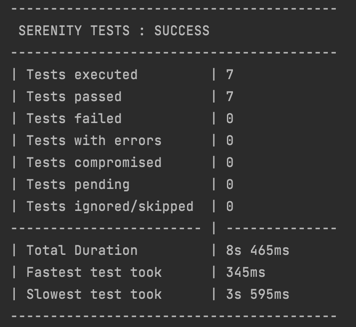
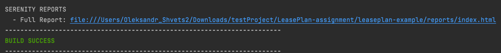

##Introduction 

Project covered 1 positive and 2 negative test cases for API endpoint GET https://waarkoop-server.herokuapp.com/api/v1/search/test/{product}

## The project directory structure
The project has build scripts for both Maven and follows the standard directory structure used in most Serenity projects:
```Gherkin
src
  + main
    + java
      + clients                   API clients
      + models                    Project DTO
      + utils                     Utilities
+ test
    + java                        Test runners and supporting code
    + resources
      + features                  Feature files

    + search                  Feature file subdirectories

             search_by_keyword.feature
```

## How to install project
For project installation:
1) clone project repository from CVS run next console command:

For GitHub
```json
$ git clone https://github.com/schvets/leaseplan-example.git
```

For GitLab
```json
$ git clone https://gitlab.com/schvets.a/leaseplan.git
```
2) navigete into project path 
```json
$ cd leaseplan-example
```

## How run project tests locally
Note: before local project run check that you have locally installed Maven or follow [**intallation guide**](https://maven.apache.org/install.html)

Execute console command 
```json
$  mvn clean verify serenity:aggregate
```
After successful test run you will see short console report



And link to more detailed local report 



## How run project tests remotely 
Project integrated with GitHub Actions and GitlabCi remote runners

###For running project remotely on GilLab: 
1) navigate to [**GitLab**](https://gitlab.com/schvets.a/leaseplan.git) select CI/CD tab => Jobs section, or open [**direct link**](https://gitlab.com/schvets.a/leaseplan/-/pipelines)
2) press "Run pipeline" button (Note: available only for authorized users)
3) wait until pipeline job finished 
4) press on job "passed" button, choose pipeline with name "Test" and click 
5) on left side in "Job artifact" section press "Browse" button => open "report" folder => find "index.html" file and click 
6) generated test report should be open 

Example of already generated test report you can find by [**link**](https://schvets.a.gitlab.io/-/leaseplan/-/jobs/2025307503/artifacts/reports/index.html)

###For running project remotely on GitHub:
1) navigate to [**Github**](https://github.com/schvets/leaseplan-example.git) click on "Action" tab
2) choose "Maven build" workflow
3) press "Run workflow" button
4) wait until workflow run finished
5) after successful run report will be generated/published and become accessible by [**link**](https://schvets.github.io/leaseplan-example/)

## How run write new tests
###For API tests:
1) Create additional client class in main/java/starter/clients package
2) Describe request/response entities in main/java/starter/models package
3) Create new package under test/resources/features package and add new feature files divided by covered functionality
4) Create new step definitions under test/java/starter/stapdefinitions package and add new feature files divided by covered functionality

## What was refactored in initial project
1) Deleted all dirs/files related to Gradle due to project requirements (• Required framework: Java Serenity + Maven)
2) Deleted .m2 and history folder  - unused/empty folders
3) Completely refactored stepDef layer (deleted unused methods, divided test logic and service layer, etc.)
4) Crated models package for storing project DTO
5) Created default and product search API clients
